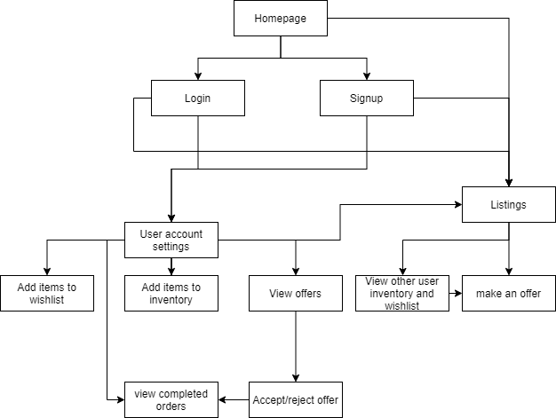
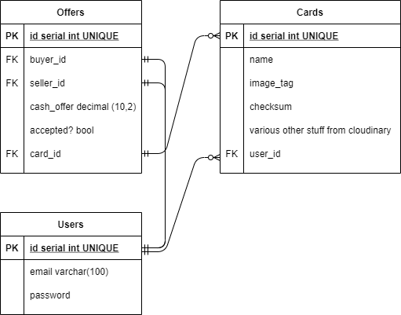

# TCboard

## A TCG marketplace for player to player buying/selling.

TradingCardboard is a marketplace for trading card game players to list their collection and buy/sell between players.

The current mainstream marketplaces for trading cards - tcgplayer.com, cardmarket.com, and cardtrader.com only provide a distribution service for players to buy cards from other card stores with money, and don't allow players to buy from eachother, or even trade cards. This causes card prices to be inflated as stores have very thin margins and players have to use improvised communities like Facebook and Discord to be able to conduct trades.

A lot of artists often do 'card alters' where they paint over the stock picture of a trading card, and these often have a lot of value, TCboard will also provide a centralised way for artists to upload their artwork and sell these as well.

> ## R7	Identification of the problem you are trying to solve by building this particular marketplace app.

The mainstream trading card marketplaces only allow players to buy from established card stores, and don't allow players to buy from eachother. This makes it unnecessarily difficult for players to trade cards between eachother without buying with money. TCboard solves this problem by allowing player-to-player transactions easily done. Users can upload a list of their collections of cards they wish to sell, and users can search eachother's inventory for cards to buy.

> ## R8	Why is it a problem that needs solving?

Trading card games have become more expensive than ever, and this is primarily due to some element of the reckless monetary speculation on various stuff in the modern economy. TCboard aims to bring the trading experience back into trading card games so that players can save money and enjoy the games without needing to spend so much money.

> ## R9	A link (URL) to your deployed app (i.e. website)

> ## R10	A link to your GitHub repository (repo).

> ## R11	Description of your marketplace app (website)

### Purpose:

TCboard aims to provide a centralised and secure marketplace for users to trade cards and track their inventory of cards they own.

### Functionality / features

- User accounts
- Users can publicly list their collection of cards on their accounts
- Users can upload their cards they want to sell
- Users can upload an image of the card they want to sell
- Users can search a database of listings for sale
- Users can click a buy now link to purchase the card
- When purchased, both users will get an email with the other's details to send the card and complete the transaction.

### Sitemap

### Screenshots

### Target audience

- My app aims to target trading card game players, that are looking to buy and sell their collection of cards.

### Tech Stack

- Ruby on Rails version 6
- Languages: HTML5 CSS3 Ruby 2.7.2
- Hosted by Heroku

> ## R12	User stories for your app

- As a user, I can view the home page, so that I can navigate the website

- As a user, I can log into my account, so that I can buy and sell on the website

- As a user, I can upload a listing with an uploaded photo, so that i can sell items

- As a user, I can view a list of all items for sale, so I can see all the available cards to buy

- As a user, I can select an item, and click a link to buy it, so that I can buy it

- As a user, I can see what cards of mine have been bought, so I can send the card to the buyer

- As a user, I can complete a transaction on an accepted offer by payment through stripe, so that I can complete the transaction.

> ## R13	Wireframes for your app

> ## R14	An ERD for your app

> ## R15	Explain the different high-level components (abstractions) in your app

> ## R16	Detail any third party services that your app will use

Google fonts

Stripe

Cloudinary

Devise

> ## R17	Describe your projects models in terms of the relationships (active record associations) they have with each other

The models of the app consist of Users, Cards, and Offers:

A User will have many Cards
A card will belong to one user
A card will have many offers
A User will have many offers as a seller
A User will have many offers as a buyer
An Offer will belong to one card

> ## R18	Discuss the database relations to be implemented in your application

**User relation:**

Email: string | Password: string (encrypted) | Name: string | Postal Address: string

When a user signs up for an account, this will create a User relation in the database with their Name, email and password. The user will then need to provide a postal address if they want to buy cards on the website.

**Card relation**

Name: string | price: float | quantity: integer | condition: string | user: reference | image: reference

When a user lists a new card for sale, this will create a Card relation with the name, price, quantity, and condition saved with the user's ID as a foreign key reference

